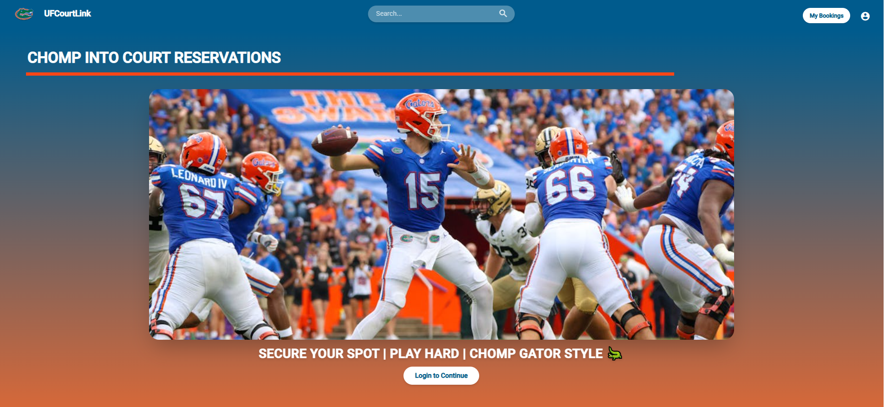
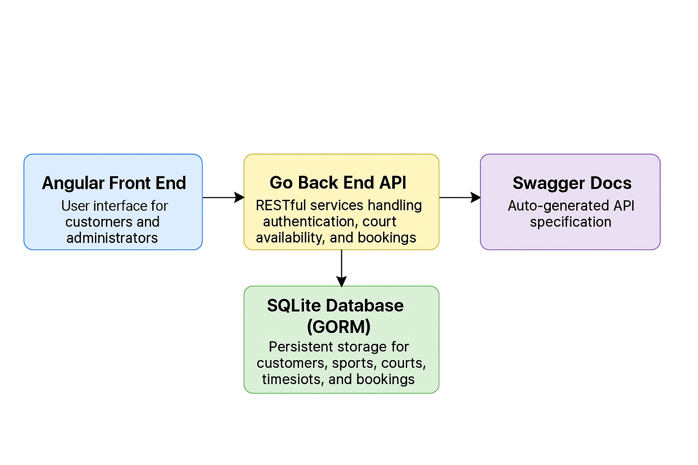

# Team CourtLink

CourtLink is a sports court reservation system designed to simplify booking and management of sports facilities. It features a modern Angular 17 front end and a Go-based back end with SQLite (via GORM), offering a seamless user experience for both end users and administrators.



## Table of Contents

- [Description](#description)
- [Features](#features)
- [Tech Stack](#tech-stack)
- [Installation](#installation)
- [Usage](#usage)
- [Architecture](#architecture)
- [Sprint Reports](#sprint-reports)
- [Contributing](#contributing)
- [License](#license)

## Description

UF CourtLink enables users to:

- Browse available sports and courts
- Check real-time time slot availability
- Create, view, and cancel bookings
- Manage courts and sports via an admin interface

Built for the University of Florida, this project demonstrates full-stack integration, real-time updates, and a clean, maintainable codebase.

## Features

- **User Booking Flow**: Select sport → view courts → choose time slot → confirm or cancel booking
- **Admin Dashboard**: Add/delete sports & courts, filter/search courts
- **Real-Time Availability**: Automatic slot blocking and freeing on booking/cancellation
- **Authentication**: Customer registration and validation
- **Responsive UI**: Angular 17 with Tailwind CSS and Angular Material

## Tech Stack

- **Front End**: Angular 17, Angular Material, Tailwind CSS, Cypress for e2e testing, Jasmine and Karma for Unit testing.
- **Back End**: Go, GORM, SQLite, Gorrila Mux for .Routing

## Installation

1. **Clone the repository**

    ```bash
    git clone https://github.com/Ashfaq-Ahmed-Mohammed/Team-CourtLink.git
    cd Team-CourtLink
    ```

2. **Back End Setup**

    ```bash
    cd BackEnd
    go mod init
    go mod tidy
    go run .  # defaults to CourtLink.db in parent directory
    ```

3. **Front End Setup**

    ```bash
    cd ..
    cd CourtLink
    npm install
    ng serve
    ```

## Usage

- Open your browser at `http://localhost:4200`
- Register or log in as a customer
- Browse sports and available courts
- Make or cancel bookings
- Access the admin panel via the `/admin` route to manage sports and courts

## Architecture

Below is the high-level architecture diagram illustrating the system components and data flow:



- **Angular Front End**: User interface for customers and administrators.
- **Go Back End API**: RESTful services handling authentication, court availability, and bookings.
- **SQLite Database (GORM)**: Persistent storage for customers, sports, courts, timeslots, and bookings.
- **Swagger Docs**: Auto-generated API specification (accessible via `/swagger/index.html`).

## Sprint Reports

Detailed sprint summaries:

- [Sprint 1 Report](https://github.com/Ashfaq-Ahmed-Mohammed/Team-CourtLink/blob/main/Sprint1/Sprint1.md)
- [Sprint 2 Report](https://github.com/Ashfaq-Ahmed-Mohammed/Team-CourtLink/blob/main/Sprint2/Sprint2.md)
- [Sprint 3 Report](https://github.com/Ashfaq-Ahmed-Mohammed/Team-CourtLink/blob/main/Sprint3/Sprint3.md)
- [Sprint 4 Report](https://github.com/Ashfaq-Ahmed-Mohammed/Team-CourtLink/blob/main/Sprint4/Sprint4.md)

## License

This project is licensed under the MIT License. See [LICENSE](https://github.com/Ashfaq-Ahmed-Mohammed/Team-CourtLink/blob/main/LICENSE) for details.
