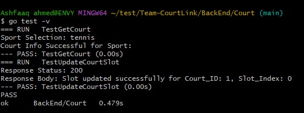
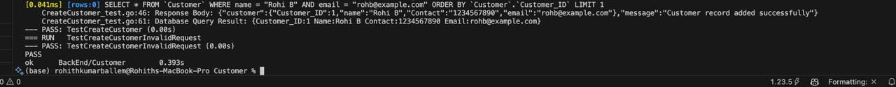
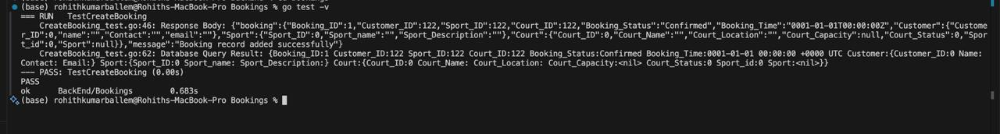
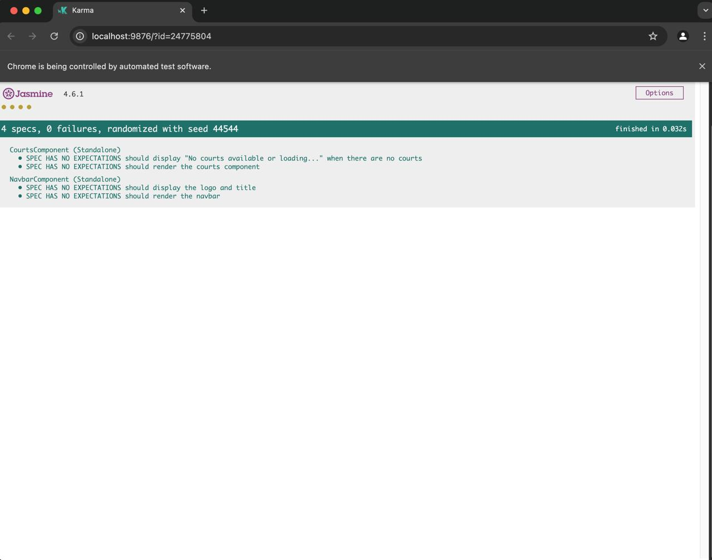
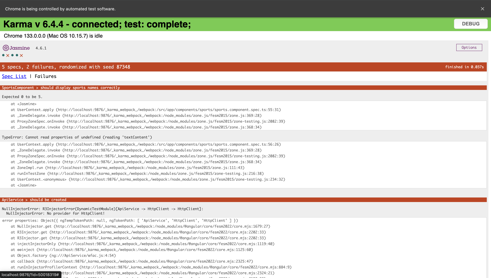
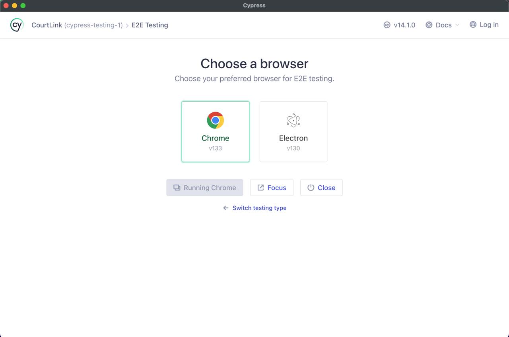
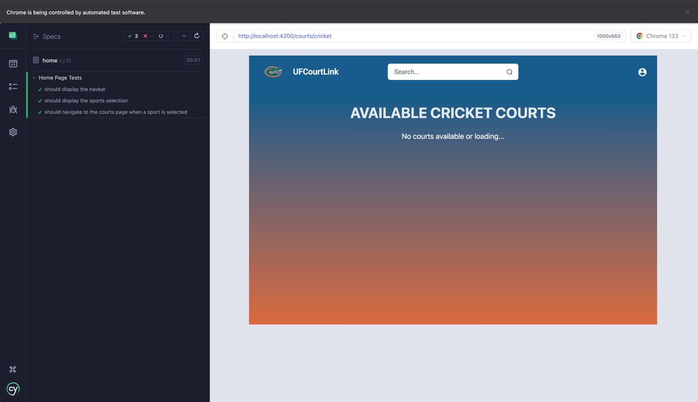

# Team-Courtlink (Project Group 4) Sprint 2

### GitHub Repository Link: [CourtLink](https://github.com/Ashfaq-Ahmed-Mohammed/Team-CourtLink)

## Work Completed in Sprint 2

### BACKEND

- Optimized the Get Courts API by reducing backend queries.
- Developed the updateCourts API to block time slots when a court is booked.
- Implemented the Bookings API to log court booking details.
- Added validations to ensure that bookings have valid customer, sport, and court information.
- Enabled Cross-Origin Resource Sharing (CORS) on the backend.
- Created detailed backend API documentation using Swagger.
- Developed unit tests with a one-to-one correspondence to functionalities. 
  - GetCourt_test
  - UpdateCourts_test
  - CreateBooking_test
  - CreateCustomer_test
- Collaborated with the Frontend team for seamless integration.

### FRONTEND
- The FrontEnd can now display the available court information based on selected sport.
- Wrote cypress tests for the following:
  - Should display the navbar
  - Should display the sports selection.
  - Should navigate to the courts page when a sport is selected
- Created Unit test cases for each component in the FrontEnd
- NavBar component:
  - Renders the navbar (component instance exists and a element is rendered)
  - Displays the logo and title (an  with alt="UF Logo" exists and a contains "UFCourtLink")
- Courts component:
  - Renders the courts component (component instance exists and a container element is rendered)
  - Displays "No courts available or loading..." when courts are empty
- Sports component:
  - Should render the component without errors.
  - Should display sport names correctly.
  - Should call SelectSport and navigate successfully.
  - Should not navigate when wrong sport is given.
- Collaborated with BackEnd team on Integration.

## Work planned but not completed as part of Sprint 2:

- **Implement booking functionality**
  - **Reason**: The integration of the front end to the backend of current APIs and features took up most of the time. However,we have the APIS to handle the booking process ready.

## Unit Test Case Results:

### BACKEND

- GetCourt_test and UpdateCourts_test Unit TestCase Results

- CreateCustomer_test Unit TestCase Results

- CreateBooking_test Unit TestCase Results

### FRONTEND

- Courts Component and Navbar Component Unit TestCase Results

- Sports Component Unit TestCase Results

## Cypress Test FRONTEND

Cypress Test Setup

Cypress Test Result

## BackEnd API Documentation (Swagger)

## Court Booking API
API for managing court bookings

## Version: 1.0

## /CreateBooking

#### POST
##### Summary:

Create a new booking

##### Description:

Creates a new booking after validating the existence of the customer, sport, and court.

##### Parameters

| Name | Located in | Description | Required | Schema |
| ---- | ---------- | ----------- | -------- | ---- |
| booking | body | Booking data | Yes | [DataBase.Bookings](#DataBase.Bookings) |

##### Responses

| Code | Description | Schema |
| ---- | ----------- | ------ |
| 201 | Booking record added successfully | object |
| 400 | Invalid request body | [DataBase.ErrorResponse](#DataBase.ErrorResponse) |
| 404 | Customer, sport, or court not found | [DataBase.ErrorResponse](#DataBase.ErrorResponse) |
| 500 | Internal server error | [DataBase.ErrorResponse](#DataBase.ErrorResponse) |

## /Customer

#### POST
##### Summary:

Create a new customer

##### Description:

Adds a new customer to the database if they do not already exist.

##### Parameters

| Name | Located in | Description | Required | Schema |
| ---- | ---------- | ----------- | -------- | ---- |
| customer | body | Customer data | Yes | [DataBase.Customer](#DataBase.Customer) |

##### Responses

| Code | Description | Schema |
| ---- | ----------- | ------ |
| 200 | Customer already exists |  |
| 201 | Customer record added successfully | object |
| 400 | Invalid request body |  |
| 500 | Internal server error |  |

## /UpdateCourtSlot

#### PUT
##### Summary:

Update court slot status

##### Description:

Toggles the availability of a court time slot. If the slot is booked, it is freed; if it is free, it is booked.

##### Parameters

| Name | Located in | Description | Required | Schema |
| ---- | ---------- | ----------- | -------- | ---- |
| updateRequest | body | Court slot update request | Yes | [DataBase.CourtUpdate](#DataBase.CourtUpdate) |

##### Responses

| Code | Description | Schema |
| ---- | ----------- | ------ |
| 200 | Slot updated successfully for Court_ID: {Court_ID}, Slot_Index: {Slot_Index} | string |
| 400 | Invalid request body or Slot_Index out of range | [DataBase.ErrorResponse](#DataBase.ErrorResponse) |
| 404 | Court time slots not found | [DataBase.ErrorResponse](#DataBase.ErrorResponse) |
| 500 | Database error or failed to update slot | [DataBase.ErrorResponse](#DataBase.ErrorResponse) |

## /getCourts

#### GET
##### Summary:

Get court availability

##### Description:

Fetches courts based on the selected sport and provides their availability status along with time slots.

##### Parameters

| Name | Located in | Description | Required | Schema |
| ---- | ---------- | ----------- | -------- | ---- |
| sport | query | Sport name | Yes | string |

##### Responses

| Code | Description | Schema |
| ---- | ----------- | ------ |
| 200 | List of available courts with time slots | [ [DataBase.CourtAvailability](#DataBase.CourtAvailability) ] |
| 400 | Missing 'sport' query parameter | [DataBase.ErrorResponse](#DataBase.ErrorResponse) |
| 404 | Sport not found or no courts available | [DataBase.ErrorResponse](#DataBase.ErrorResponse) |

### Models

#### DataBase.Bookings

| Name | Type | Description | Required |
| ---- | ---- | ----------- | -------- |
| Booking_ID | integer |  | No |
| Booking_Status | string |  | No |
| Booking_Time | string |  | No |
| Court_ID | integer |  | No |
| Customer_ID | integer |  | No |
| Sport_ID | integer |  | No |
| court | [DataBase.Court](#DataBase.Court) |  | No |
| customer | [DataBase.Customer](#DataBase.Customer) |  | No |
| sport | [DataBase.Sport](#DataBase.Sport) |  | No |

#### DataBase.Court

| Name | Type | Description | Required |
| ---- | ---- | ----------- | -------- |
| Court_ID | integer |  | No |
| Court_Location | string |  | No |
| Court_Name | string |  | No |
| Court_Status | integer |  | No |
| Sport_id | integer |  | No |
| court_Capacity | integer |  | No |
| sport | [DataBase.Sport](#DataBase.Sport) |  | No |

#### DataBase.CourtAvailability

| Name | Type | Description | Required |
| ---- | ---- | ----------- | -------- |
| CourtID | integer |  | No |
| CourtName | string |  | No |
| CourtStatus | integer |  | No |
| Slots | [ integer ] |  | No |

#### DataBase.CourtUpdate

| Name | Type | Description | Required |
| ---- | ---- | ----------- | -------- |
| Court_ID | integer |  | No |
| Court_Name | string |  | No |
| Customer_ID | integer |  | No |
| Slot_Index | integer |  | No |
| Sport_name | string |  | No |

#### DataBase.Customer

| Name | Type | Description | Required |
| ---- | ---- | ----------- | -------- |
| Contact | string |  | No |
| Customer_ID | integer |  | No |
| email | string |  | No |
| name | string |  | No |

#### DataBase.ErrorResponse

| Name | Type | Description | Required |
| ---- | ---- | ----------- | -------- |
| message | string |  | No |

#### DataBase.Sport

| Name | Type | Description | Required |
| ---- | ---- | ----------- | -------- |
| Sport_ID | integer |  | No |
| Sport_name | string |  | No |
| sport_Description | string |  | No |

### Video Recordings
- [Sprint 2 Video Recording](https://drive.google.com/file/d/1lv_fPE8VRDVc5dtWKcTPM0qKLrOx4Q8K/view?usp=drive_link)