# Team-Courtlink (Project Group 4) Sprint 3

### GitHub Repository Link: [CourtLink](https://github.com/Ashfaq-Ahmed-Mohammed/Team-CourtLink)

## Work Completed in Sprint 3

### BACKEND
- Implemented an API to update court availability when a timeslot is booked, ensuring booking details are recorded in the Bookings table.

- Optimized the getCourts API to reduce the number of database queries.

- Developed an API that allows users to cancel a booking, which frees up the blocked timeslot and updates the court status in the Booking table.

- Created an API that returns a JSON list of bookings for a particular customer to manage their reservations.

- Added new unit tests for the CancelBookingAndUpdateSlot, UpdateCourtSlotAndBooking, and listBookings APIs, and collaborated with the front-end team to integrate the back-end with the Angular application flow while updating the database schema as needed.

- Implemented an API to list courts which helps in showcasing the courts available before adding or removing courts to the admin portal.

- Implemented an API to create court which is useful to add courts when there is a new court available.

- Implemented an API to create sport which provides capability to add new sports which are introduced.

- Implemented an API to list sports which helps in showcasing the sports available before adding or removing sports to admin portal and to sports list for main portal.

- Implemented an API to delete court. This helps in removing the courts that are not needed.

- Implemented logic which takes in emailID of the user and fetch the customer id which is used for the create booking logic.

- Implemented logic to update booking status for delete.

- Added unit test cases for Create Court, Create Sport, List Courts, List Sports and Delete Court and collaborated with front-end team to integrate angular components as per the need and enhancing the database schema as required.

- Swagger documentation has been added to new API’s at BackEnd.

### FRONTEND

Admin Page :

- An admin page has been added to make addition and deletion of courts and sports easier. It has the following components:

- admin-sports component – The sports are tabulated and new sports can be added.

- admin-courts component – The courts are tabulated against their respective sports. A filter search bar allows for easy navigation and new courts can be added.

- User testing has been conducted for all 3 of these components and the subsequent pull requests have detailed descriptions of them along with pictures.

Booking Flow:

- Now able to update the booking details in real time to the database by sending a JSON to the backend consisting the courtID, courtName, Slot_Index, Sport_name, Sport_ID, Customer_email.
- Also made sure to reload the page after booking confirmation to show updated court slots.
- Added a toast notification post booking confirmation from BackEnd otherwise an alert with Booking Failed dialog.
- Also we made sure that the booking fails if the user who is trying to book a slot is not registered with us.
- Performed unit testing on the courts component again in sprint two after adding functionalities.

My-Bookings :

- Sends a GET request to /listBookings?email=... to fetch bookings.
- We are now displaying the bookings of the user with a good UI and also have the option to CANCEL booking.
- For this, a request to the backend with user information will fetch all the booking details affiliated with that user.
- Performed Unit Testing on this component to make sure everything is working.

## Unit Test Case Results:

## FROM SPRINT 2

### BACKEND

- GetCourt_test and UpdateCourts_test Unit TestCase Results

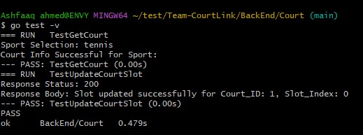

- CreateCustomer_test Unit TestCase Results

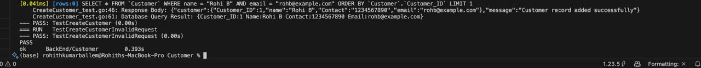

- CreateBooking_test Unit TestCase Results

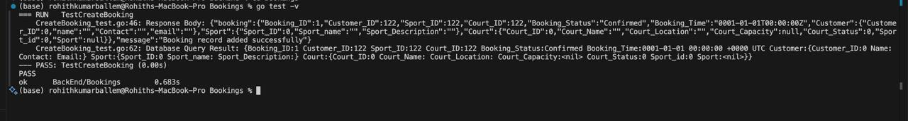

### FRONTEND

- Courts Component and Navbar Component Unit TestCase Results

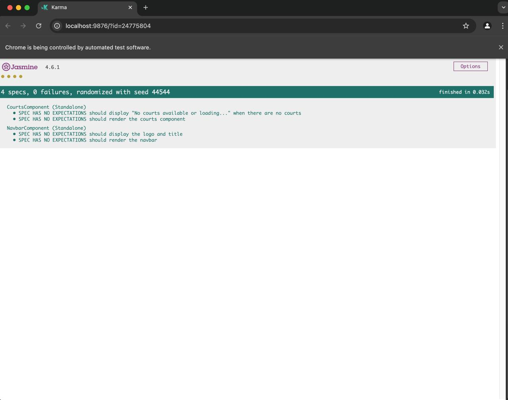

- Sports Component Unit TestCase Results

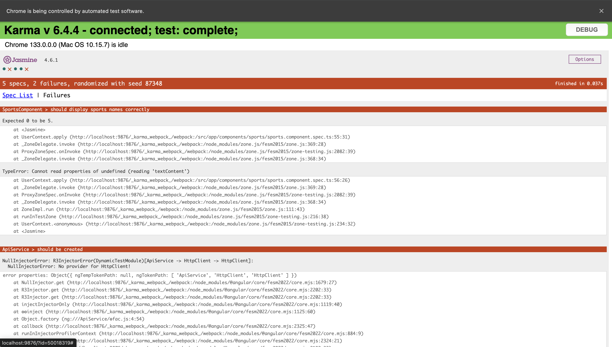

## Cypress Test FRONTEND

Cypress Test Setup

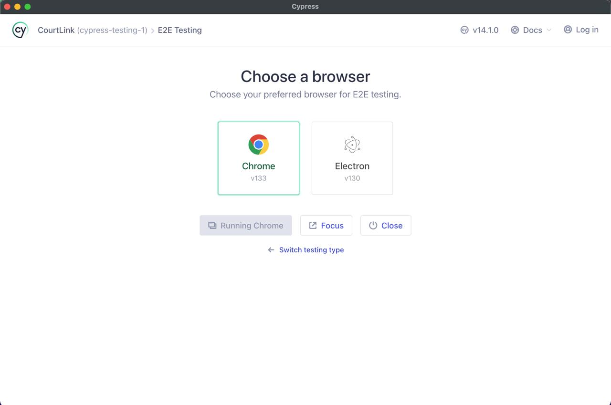

Cypress Test Result

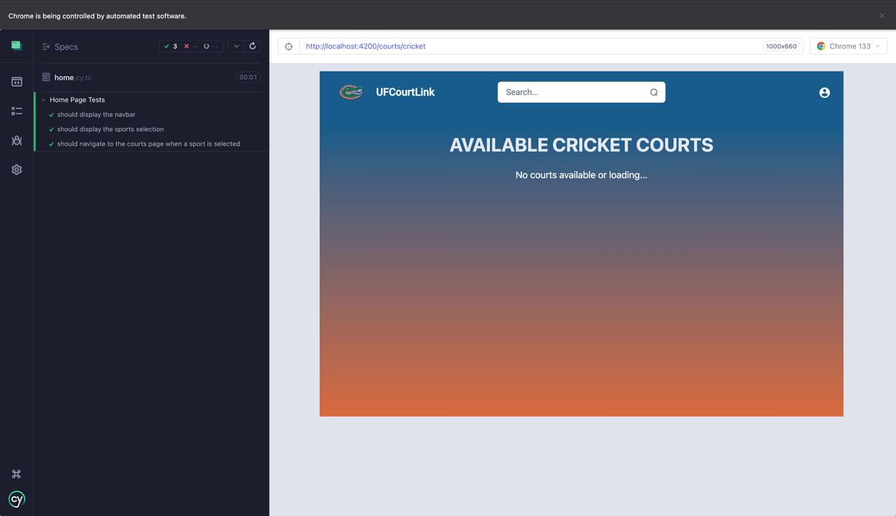

## FROM SPRINT 3

### BACKEND

- CreateSport_test Unit TestCase Result

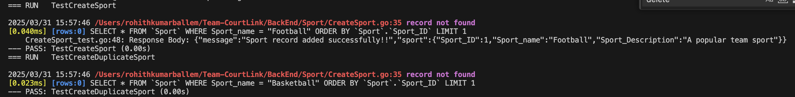

- CreateCourt_test Unit TestCase Result

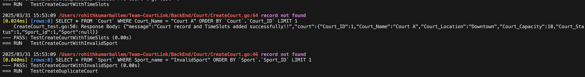

- ListCourts_test Unit TestCase Result

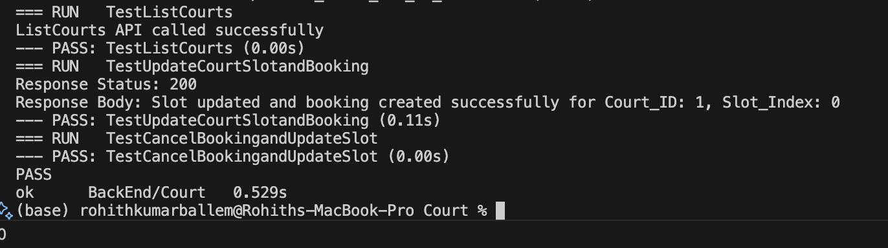

- ListSports_test Unit TestCase Result

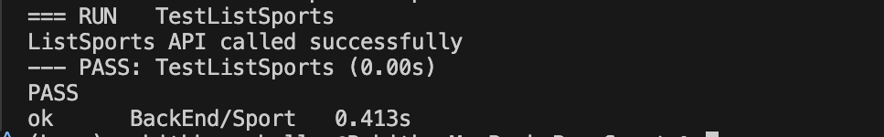

- DeleteCourt_test Unit TestCase Result

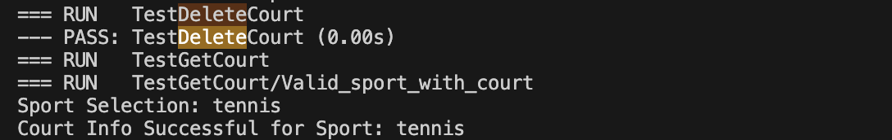

- ListBookings_test Unit TestCase Result

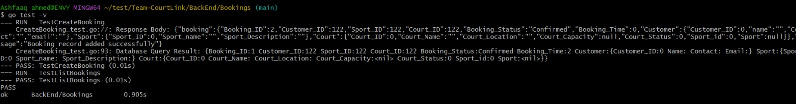

- GetCourts_test Unit TestCase Result

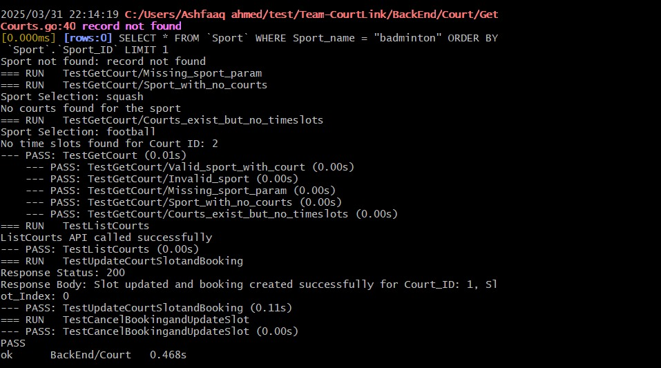

### FRONTEND

- Courts Component Unit TestCase Results

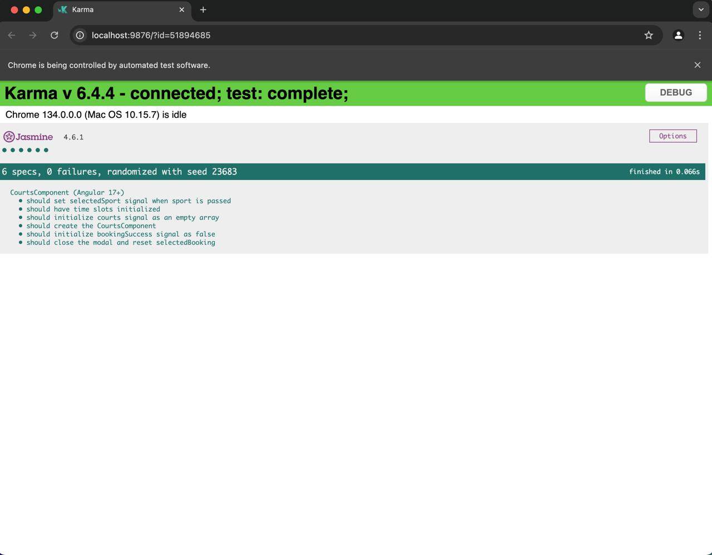

- Navbar Component Unit TestCase Results

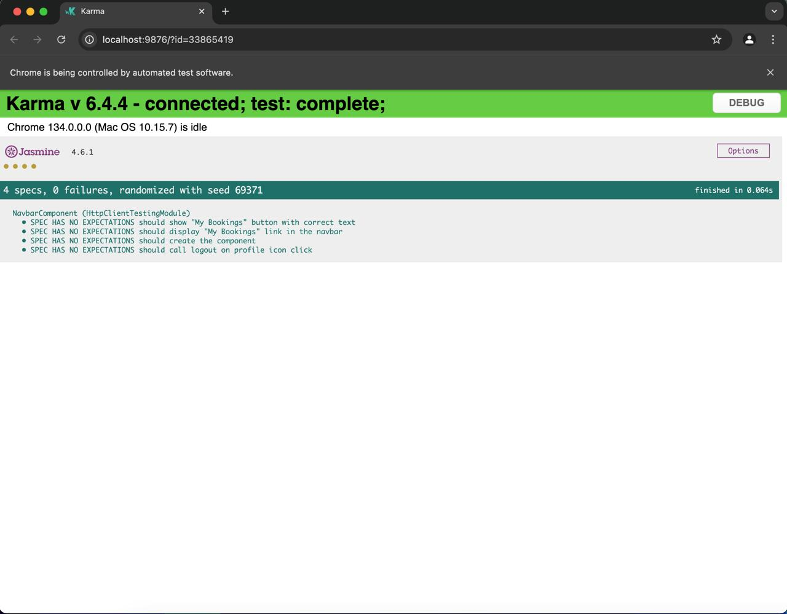

- Booking Component Unit TestCase Results

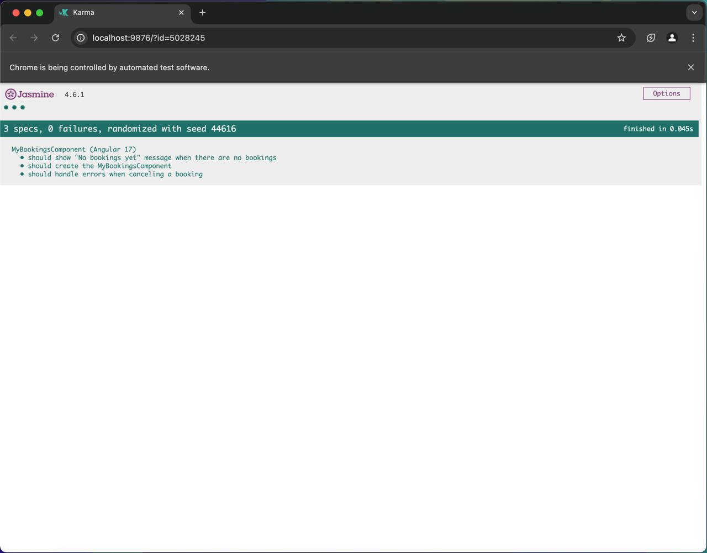

- Admin Component Unit TestCase Results

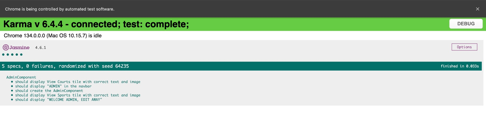

- Admin court Component Unit TestCase Results

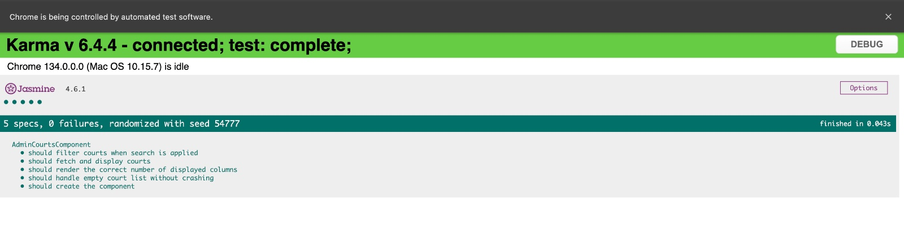

- Admin sports Component Unit TestCase Results

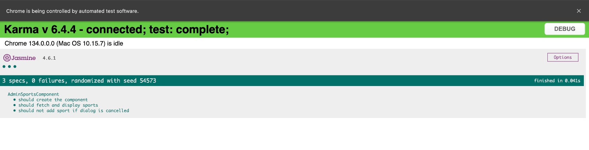

## Court Booking API Documentation

### Version: 1.0

### Description: 
API for managing court bookings.

### Host: 
localhost:8080

### Base Path: 
/

---

## Endpoints

### 1. **/CancelBookingandUpdateSlot** (PUT)

#### Summary:
Cancel a booking and update court time slot

#### Description:
Cancels a booking by updating its status to "Cancelled" and marks the corresponding time slot (based on Booking_Time) as available (sets it to 1) in the Court_TimeSlots record.

#### Parameters

| Name            | Located in | Description          | Required | Schema                               |
|-----------------|------------|----------------------|----------|--------------------------------------|
| cancelRequest   | body       | Cancel Booking Request | Yes      | [DataBase.CancelRequest](#DataBase.CancelRequest) |

#### Responses

| Code | Description | Schema |
| ---- | ----------- | ------ |
| 200  | Booking cancelled and slot updated successfully | string |
| 400  | Invalid request body or Invalid Slot_Index | string |
| 404  | Booking not found or Court TimeSlots not found | string |
| 500  | Failed to start transaction, database error, or transaction commit failed | string |

---

### 2. **/CreateBooking** (POST)

#### Summary:
Create a new booking

#### Description:
Creates a new booking after validating the existence of the customer, sport, and court.

#### Parameters

| Name   | Located in | Description     | Required | Schema                           |
|--------|------------|-----------------|----------|----------------------------------|
| booking | body      | Booking data    | Yes      | [DataBase.Bookings](#DataBase.Bookings) |

#### Responses

| Code | Description | Schema |
| ---- | ----------- | ------ |
| 201  | Booking record added successfully | object |
| 400  | Invalid request body | [DataBase.ErrorResponse](#DataBase.ErrorResponse) |
| 404  | Customer, sport, or court not found | [DataBase.ErrorResponse](#DataBase.ErrorResponse) |
| 500  | Internal server error | [DataBase.ErrorResponse](#DataBase.ErrorResponse) |

---

### 3. **/CreateCourt** (POST)

#### Summary:
Create a new court with associated time slots

#### Description:
Creates a new court and assigns time slots for bookings.

#### Parameters

| Name   | Located in | Description     | Required | Schema                          |
|--------|------------|-----------------|----------|---------------------------------|
| court  | body       | Court data      | Yes      | [DataBase.Court](#DataBase.Court) |

#### Responses

| Code | Description | Schema |
| ---- | ----------- | ------ |
| 201  | Court created successfully | [Court.CourtCreationResponse](#Court.CourtCreationResponse) |
| 400  | Invalid request body | object |
| 500  | Failed to create court | object |

---

### 4. **/CreateSport** (POST)

#### Summary:
Create a new sport record

#### Description:
Adds a new sport to the database if it does not already exist.

#### Parameters

| Name   | Located in | Description     | Required | Schema                          |
|--------|------------|-----------------|----------|---------------------------------|
| sport  | body       | Sport object    | Yes      | [DataBase.Sport](#DataBase.Sport) |

#### Responses

| Code | Description | Schema |
| ---- | ----------- | ------ |
| 201  | Sport record added successfully | object |
| 400  | Sport_name is required or the sport already exists | string |
| 500  | Internal Server Error | string |

---

### 5. **/Customer** (POST)

#### Summary:
Create a new customer

#### Description:
Adds a new customer to the database if they do not already exist.

#### Parameters

| Name     | Located in | Description   | Required | Schema                           |
|----------|------------|---------------|----------|----------------------------------|
| customer | body       | Customer data | Yes      | [DataBase.Customer](#DataBase.Customer) |

#### Responses

| Code | Description | Schema |
| ---- | ----------- | ------ |
| 200  | Customer already exists | |
| 201  | Customer record added successfully | object |
| 400  | Invalid request body | |
| 500  | Internal server error | |

---

### 6. **/DeleteCourt** (DELETE)

#### Summary:
Delete a court record

#### Description:
Deletes a court record from the database based on the court name.

#### Parameters

| Name        | Located in | Description   | Required | Schema |
|-------------|------------|---------------|----------|--------|
| court_name  | query      | Court Name    | Yes      | string |

#### Responses

| Code | Description | Schema |
| ---- | ----------- | ------ |
| 200  | Court deleted successfully | object |
| 400  | Invalid court name | object |
| 404  | Court not found | object |
| 500  | Internal server error | object |

---

### 7. **/ListCourts** (GET)

#### Summary:
List all courts with their associated sports

#### Description:
Retrieves a list of all courts along with the corresponding sport names.

#### Responses

| Code | Description | Schema |
| ---- | ----------- | ------ |
| 200  | List of courts and their associated sports | [DataBase.CourtData](#DataBase.CourtData) |
| 500  | Database error while fetching courts | string |

---

### 8. **/ListSports** (GET)

#### Summary:
Get a list of sports

#### Description:
Fetches all sports names from the database.

#### Responses

| Code | Description | Schema |
| ---- | ----------- | ------ |
| 200  | List of sport names | array of strings |
| 500  | Failed to fetch sports | object |

---

### 9. **/UpdateCourtSlotandBooking** (PUT)

#### Summary:
Update court slot and create booking

#### Description:
Toggles the availability of a court time slot and, based on the provided customer email and sport name, updates the booking status.

#### Parameters

| Name           | Located in | Description                               | Required | Schema                                    |
|----------------|------------|-------------------------------------------|----------|-------------------------------------------|
| updateRequest  | body       | Court slot update request                 | Yes      | [DataBase.CourtUpdate](#DataBase.CourtUpdate) |

#### Responses

| Code | Description | Schema |
| ---- | ----------- | ------ |
| 200  | Slot updated and booking created successfully | string |
| 400  | Invalid request body or Slot_Index out of range | [DataBase.ErrorResponse](#DataBase.ErrorResponse) |
| 404  | Court time slots, Customer, or Sport not found | [DataBase.ErrorResponse](#DataBase.ErrorResponse) |
| 500  | Database error or failed to update slot/booking | [DataBase.ErrorResponse](#DataBase.ErrorResponse) |

---

### 10. **/getCourts** (GET)

#### Summary:
Get court availability

#### Description:
Fetches courts based on the selected sport and provides their availability status along with time slots.

#### Parameters

| Name   | Located in | Description     | Required | Schema |
|--------|------------|-----------------|----------|--------|
| sport  | query      | Sport name      | Yes      | string |

#### Responses

| Code | Description | Schema |
| ---- | ----------- | ------ |
| 200  | List of available courts with time slots | [DataBase.CourtAvailability](#DataBase.CourtAvailability) |
| 400  | Missing 'sport' query parameter | [DataBase.ErrorResponse](#DataBase.ErrorResponse) |
| 404  | Sport not found or no courts available | [DataBase.ErrorResponse](#DataBase.ErrorResponse) |

---

### 11. **/listBookings** (GET)

#### Summary:
List bookings for a customer

#### Description:
Retrieves a list of bookings for a customer by email. Returns booking details including court name, sport name, slot time, and booking status.

#### Parameters

| Name   | Located in | Description     | Required | Schema |
|--------|------------|-----------------|----------|--------|
| email  | query      | Customer email  | Yes      | string |

#### Responses

| Code | Description | Schema |
| ---- | ----------- | ------ |
| 200  | List of bookings for the customer | [Bookings.BookingResponse](#Bookings.BookingResponse) |
| 400  | Email query parameter is required | string |
| 404  | Customer not found | string |
| 500  | Database error while fetching bookings | string |

---

## Models

### DataBase.CancelRequest

| Name         | Type    | Description               | Required |
|--------------|---------|---------------------------|----------|
| Booking_ID   | integer | Unique identifier for booking | Yes |

### DataBase.Court

| Name          | Type    | Description            | Required |
|---------------|---------|------------------------|----------|
| Court_ID      | integer | Court ID               | Yes |
| Court_Location| string  | Court Location         | Yes |
| Court_Name    | string  | Court Name             | Yes |
| Court_Status  | integer | Court Availability     | Yes |
| Sport_id      | integer | Sport ID               | Yes |
| court_Capacity| integer | Court Capacity         | Yes |
| sport         | [DataBase.Sport](#DataBase.Sport) | Associated sport | Yes |

### DataBase.CourtAvailability

| Name        | Type    | Description             | Required |
|-------------|---------|-------------------------|----------|
| CourtID     | integer | Court ID                | Yes |
| CourtName   | string  | Court Name              | Yes |
| CourtStatus | integer | Availability status     | Yes |
| Slots       | [integer] | Available time slots    | Yes |

### DataBase.CourtUpdate

| Name        | Type    | Description             | Required |
|-------------|---------|-------------------------|----------|
| Court_ID    | integer | Court ID                | Yes |
| Court_Name  | string  | Court Name              | Yes |
| Customer_ID | integer | Customer ID             | Yes |
| Slot_Index  | integer | Slot Index              | Yes |
| Sport_name  | string  | Sport Name              | Yes |

### DataBase.Customer

| Name          | Type    | Description            | Required |
|---------------|---------|------------------------|----------|
| Contact       | string  | Customer contact info  | Yes |
| Customer_ID   | integer | Customer identifier    | Yes |
| email         | string  | Customer email address | Yes |
| name          | string  | Customer name          | Yes |

### DataBase.ErrorResponse

| Name     | Type   | Description          | Required |
|----------|--------|----------------------|----------|
| message  | string | Error message        | Yes |

### DataBase.Sport

| Name              | Type    | Description                | Required |
|-------------------|---------|----------------------------|----------|
| Sport_ID          | integer | Sport identifier           | Yes |
| Sport_name        | string  | Name of the sport          | Yes |
| sport_Description | string  | Description of the sport   | Yes |

---

### Video Recordings
- [Sprint 3 Video Recording](https://drive.google.com/file/d/1FumildnwsavBMdAnkCbc_pSiUJB61kMZ/view?usp=drive_link)
