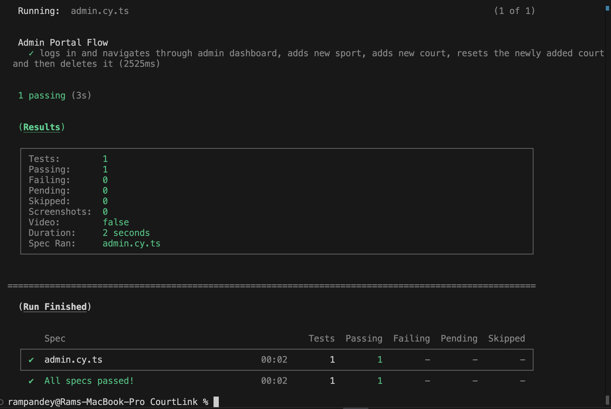

# Team-Courtlink (Project Group 4) Sprint 4

### GitHub Repository Link: [CourtLink](https://github.com/Ashfaq-Ahmed-Mohammed/Team-CourtLink)

## Work Completed in Sprint 4

### BACKEND

- Optimized the courts update API for efficiency.

- Implemented a scheduler to automatically reset court slots at midnight.

- Added admin functionality to manually reset court slots.

- Enhanced the Reset Courts API to support resets by court name.

- Created unit tests for:

    - Reset Court functionality

    - Admin Login API

    - Create Customer API

    - List Sport API

- Improved coverage for List Courts and List Bookings APIs

- Updated SQL schema (sql.txt) with the latest database changes.

- Documented the new Reset Court and Admin Login APIs.

- Reran and verified that all unit tests are passing successfully.

- Colloborated with the frontend team for integration.

### FRONTEND

- Added a Cancel Booking button under "My Bookings", and linked it to the cancel API in the backend

- Implemented a filter to view only cancelled bookings.

- Replaced the user icon with a hamburger menu for better navigation.

- Added a Logout button and a Contact Us button inside the hamburger menu.

- Created a homepage slideshow for users before login.

- Added a login button on the homepage to initiate the login process via Auth0.

- Conducted unit testing for all new frontend features.

- Performed Cypress testing for the homepage and booking flow.

- Colloborated with the backend team for integration.

- Secured admin access by implementing username and password authentication to prevent unauthorized use.

- Added a "Delete Court" button to the admin portal for easy court removal.

- Enabled court reset functionality from the admin portal, allowing admins to clear all bookings for a specific court.

- Cypress tested the entire admin portal to validate all functionalities.

- Unit tested the newly created admin-login component.

## Unit Test Case Results:

## FROM SPRINT 4

### BACKEND

- AdminLogin API Test Case

- Create_Customer API Test Cases

- List Sports API Test Cases

- List Bookings API Test Cases

- List Courts and Reset Courts API Test Cases

### FRONTEND

### Cypress Testing
- Cypress Testing - User Flow

- Cypress Testing - Admin Flow

### Unit Testing
- Sports Component

- Navbar Component

- Admin Login Component

# Backend API Documentation (Swagger)

# Court Booking API
API for managing court bookings.

# Version: 1.2

---

# Endpoints

## 1. **POST /AdminLogin**
### Summary:
Admin login

### Description:
Validates admin credentials (plain text match).

### Parameters
| Name | Located in | Description | Required | Schema |
|-----|------------|-------------|----------|--------|
| credentials | body | Admin credentials | Yes | Admin.LoginRequest |

### Responses
| Code | Description | Schema |
|-----|-------------|--------|
| 200 | Login successful | object |
| 400 | Invalid request body | object |
| 401 | Unauthorized | object |

---

## 2. **PUT /CancelBookingandUpdateSlot**
### Summary:
Cancel a booking and update court time slot

### Description:
Cancels a booking and marks the corresponding time slot as available.

### Parameters
| Name | Located in | Description | Required | Schema |
|-----|------------|-------------|----------|--------|
| cancelRequest | body | Cancel Booking Request | Yes | DataBase.CancelRequest |

### Responses
| Code | Description | Schema |
|-----|-------------|--------|
| 200 | Booking cancelled and slot updated successfully | string |
| 400 | Invalid request body or Invalid Slot_Index | string |
| 404 | Booking not found or Court TimeSlots not found | string |
| 500 | Database error or transaction commit failed | string |

---

## 3. **POST /CreateBooking**
### Summary:
Create a new booking

### Description:
Creates a new booking after validating customer, sport, and court.

### Parameters
| Name | Located in | Description | Required | Schema |
|-----|------------|-------------|----------|--------|
| booking | body | Booking data | Yes | DataBase.Bookings |

### Responses
| Code | Description | Schema |
|-----|-------------|--------|
| 201 | Booking record added successfully | object |
| 400 | Invalid request body | DataBase.ErrorResponse |
| 404 | Customer, sport, or court not found | DataBase.ErrorResponse |
| 500 | Internal server error | DataBase.ErrorResponse |

---

## 4. **POST /CreateCourt**
### Summary:
Create a new court with associated time slots

### Description:
Creates a new court and assigns time slots for bookings.

### Parameters
| Name | Located in | Description | Required | Schema |
|-----|------------|-------------|----------|--------|
| court | body | Court data | Yes | DataBase.Court |

### Responses
| Code | Description | Schema |
|-----|-------------|--------|
| 201 | Court created successfully | Court.CourtCreationResponse |
| 400 | Invalid request body | object |
| 500 | Failed to create court | object |

---

## 5. **POST /CreateSport**
### Summary:
Create a new sport record

### Description:
Adds a new sport if it does not already exist.

### Parameters
| Name | Located in | Description | Required | Schema |
|-----|------------|-------------|----------|--------|
| sport | body | Sport object | Yes | DataBase.Sport |

### Responses
| Code | Description | Schema |
|-----|-------------|--------|
| 201 | Sport record added successfully | object |
| 400 | Sport_name is required or sport already exists | string |
| 500 | Internal server error | string |

---

## 6. **POST /Customer**
### Summary:
Create a new customer

### Description:
Adds a new customer to the database if they do not already exist.

### Parameters
| Name | Located in | Description | Required | Schema |
|-----|------------|-------------|----------|--------|
| customer | body | Customer data | Yes | DataBase.Customer |

### Responses
| Code | Description | Schema |
|-----|-------------|--------|
| 200 | Customer already exists | object |
| 201 | Customer record added successfully | object |
| 400 | Invalid request body | object |
| 500 | Internal server error | object |

---

## 7. **DELETE /DeleteCourt**
### Summary:
Delete a court record

### Description:
Deletes a court from the database based on court name.

### Parameters
| Name | Located in | Description | Required | Schema |
|-----|------------|-------------|----------|--------|
| court_name | query | Court Name | Yes | string |

### Responses
| Code | Description | Schema |
|-----|-------------|--------|
| 200 | Court deleted successfully | object |
| 400 | Invalid court name | object |
| 404 | Court not found | object |
| 500 | Internal server error | object |

---

## 8. **GET /ListCourts**
### Summary:
List all courts with their associated sports

### Description:
Retrieves a list of all courts and their sports.

### Responses
| Code | Description | Schema |
|-----|-------------|--------|
| 200 | List of courts and their associated sports | Court.CourtData |
| 500 | Database error while fetching courts | string |

---

## 9. **GET /ListSports**
### Summary:
Get a list of sports

### Description:
Fetches all sports names from the database.

### Responses
| Code | Description | Schema |
|-----|-------------|--------|
| 200 | List of sport names | array of strings |
| 500 | Failed to fetch sports | object |

---

## 10. **PUT /UpdateCourtSlotandBooking**
### Summary:
Update court slot and create booking

### Description:
Toggles the availability of a court time slot and updates booking.

### Parameters
| Name | Located in | Description | Required | Schema |
|-----|------------|-------------|----------|--------|
| updateRequest | body | Court slot update request | Yes | DataBase.CourtUpdate |

### Responses
| Code | Description | Schema |
|-----|-------------|--------|
| 200 | Slot updated and booking created successfully | string |
| 400 | Invalid request body or Slot_Index out of range | DataBase.ErrorResponse |
| 404 | Court time slots, Customer, or Sport not found | DataBase.ErrorResponse |
| 500 | Database error or failed to update slot/booking | DataBase.ErrorResponse |

---

## 11. **GET /getCourts**
### Summary:
Get court availability

### Description:
Fetches courts based on selected sport and provides slot availability.

### Parameters
| Name | Located in | Description | Required | Schema |
|-----|------------|-------------|----------|--------|
| sport | query | Sport name | Yes | string |

### Responses
| Code | Description | Schema |
|-----|-------------|--------|
| 200 | List of available courts with time slots | DataBase.CourtAvailability |
| 400 | Missing 'sport' query parameter | DataBase.ErrorResponse |
| 404 | Sport not found or no courts available | DataBase.ErrorResponse |

---

## 12. **GET /listBookings**
### Summary:
List bookings for a customer

### Description:
Retrieves booking details by customer email.

### Parameters
| Name | Located in | Description | Required | Schema |
|-----|------------|-------------|----------|--------|
| email | query | Customer email | Yes | string |

### Responses
| Code | Description | Schema |
|-----|-------------|--------|
| 200 | List of bookings for customer | Bookings.BookingResponse |
| 400 | Email query parameter is required | string |
| 404 | Customer not found | string |
| 500 | Database error while fetching bookings | string |

---

## 13. **PUT /resetCourtSlots**
### Summary:
Reset all time-slots for available courts

### Description:
Sets every slot (08–18h) back to available (value 1) for courts whose status is available.

### Parameters
| Name | Located in | Description | Required | Schema |
|-----|------------|-------------|----------|--------|
| court_name | query | Reset slots for a specific court (optional) | No | string |

### Responses
| Code | Description | Schema |
|-----|-------------|--------|
| 200 | Slots reset successfully | object |
| 500 | Database error while updating slots | DataBase.ErrorResponse |

---

# Models

## Models

### Admin.LoginRequest
| Name      | Type    | Description        |
|-----------|---------|--------------------|
| username  | string  | Admin username      |
| password  | string  | Admin password      |

---

### DataBase.Bookings
| Name            | Type    | Description                   |
|-----------------|---------|-------------------------------|
| Booking_ID      | integer | Booking ID                    |
| Customer_ID     | integer | Customer ID                   |
| Sport_ID        | integer | Sport ID                      |
| Court_ID        | integer | Court ID                      |
| Booking_Status  | string  | Booking status                |
| Booking_Time    | integer | Slot index for booking        |

---

### DataBase.CancelRequest
| Name        | Type    | Description                     |
|-------------|---------|---------------------------------|
| Booking_ID  | integer | Unique identifier for booking   |

---

### DataBase.Court
| Name            | Type    | Description         |
|-----------------|---------|---------------------|
| Court_ID        | integer | Court ID             |
| Court_Name      | string  | Court Name           |
| Court_Location  | string  | Court Location       |
| Court_Status    | integer | Availability Status  |
| court_Capacity  | integer | Court Capacity       |
| Sport_id        | integer | Sport ID             |

---

### DataBase.CourtAvailability
| Name         | Type      | Description                 |
|--------------|-----------|-----------------------------|
| CourtID      | integer   | Court ID                    |
| CourtName    | string    | Court Name                  |
| CourtStatus  | integer   | Court Status (available etc)|
| Slots        | array     | List of available slots     |

---

### DataBase.CourtUpdate
| Name           | Type    | Description                  |
|----------------|---------|------------------------------|
| Court_ID       | integer | Court ID                     |
| Court_Name     | string  | Court Name                   |
| Customer_email | string  | Customer's Email Address     |
| Slot_Index     | integer | Slot index to be booked      |
| Sport_name     | string  | Sport Name                   |

---

### DataBase.Customer
| Name         | Type    | Description            |
|--------------|---------|------------------------|
| Customer_ID  | integer | Customer ID            |
| name         | string  | Customer Name          |
| email        | string  | Customer Email Address |
| Contact      | string  | Contact Info           |

---

### DataBase.Sport
| Name               | Type    | Description              |
|--------------------|---------|--------------------------|
| Sport_ID           | integer | Sport ID                 |
| Sport_name         | string  | Name of the sport        |
| sport_Description  | string  | Description of the sport |

---

### DataBase.ErrorResponse
| Name     | Type    | Description     |
|----------|---------|-----------------|
| message  | string  | Error message    |

---

### Video Recordings
- [Sprint 4 Video Recording](https://drive.google.com/file/d/1Qpmgb9lX2kxYKiYbhfdFbA6wNuay29la/view?usp=sharing)
